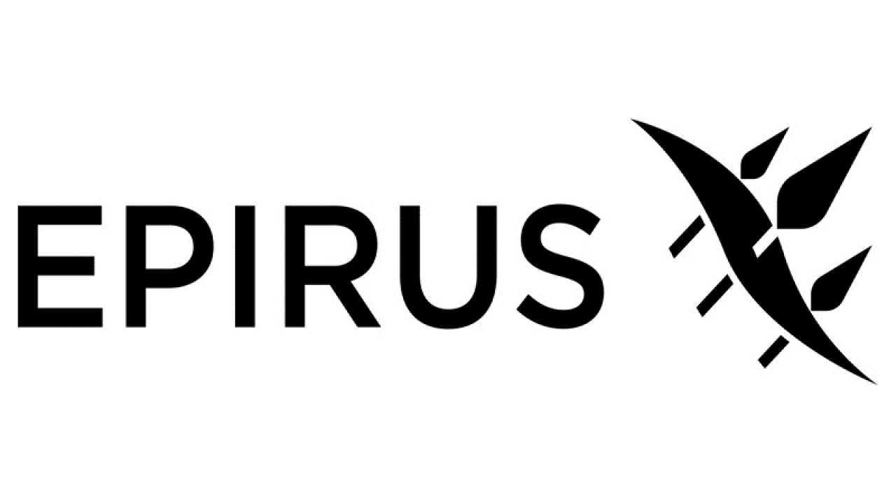

# Case Study of Epirus, Inc.                                    By Dylan Ross

---
## We're at War
###  Whether or not we would like to admit it, we are opposed today, by a ruthless and monolithic conspiracy which relies on covert means, instead of outright invasion. The scale of which the DoD must operate is formidable. Luckily for us, there are entities out there that are more than willing to meet the challenge.

---

## Company Spotlight 
* **The Department of Defense (DoD)** has been utilzing data- and Artificial Intelligence (AI) enabled systems for over 60 years. By equipping the United States and her military with these tools and resources to make its peacekeeping and warfighting capabilities more effective, will only increase the efficiency the DoD does business.  While the United States does possess capabilities that our competitors do not. The 2022 National Defense Strategy describes the need for the **US to strengthen deterrence to the People's Republic of China, which intends to field AI for military advantage.**

* In a world landscape that is changing at a rapid pace, the advancement of technology and shift in global values has led to the rise of a wide array of threats. **The unmanned aerial system (UAS) threat has proliferated around the globe.** Aside from most major militaries rapidly adopting and developing unmanned technologies; It is alarming that *anyone* can go into a store buy a drone and retrofit it with a bomb or other weapon and fly it to an area.

[Epirus, Inc.](https://www.epirusinc.com) is effective in their approach to combat these threats. Much like the Greek Hero *Theseus* wielder of the  *The Epirus*, a bow with infinite arrows; they strive to be fast, efficient, and agile with limitless innovation. They are a tech company that has been developing software-defined directed energy systems. These systems have power management solutions, as well as electronic countermeasures, such as their Leonidas High Powered Microwave system (HPM) for vehcicular, robotic and alien technologies.  

The high-growth tech startup was founded in 2018 by Bo Marr, Grant L. Verstandig, Joe Lonsdale, John Tenet, Max Mednik,and Nathan Mintz. They set out to create systems that help land borne personnel and civilians survive drone swarms. As we have seen on many videos that can be found throughout the internet, even "over-the-counter" drones are a menacing threat and it is difficult to neutralize even just one, let alone three. In the future it is expected that we can see drone swarms of up to 30 units.

The Leonidas system is their flagship ground based counter electronic system. It utilizes High Powered microwave directed energy combined with AI targeting and power mangement to fry the electronics of opposing drones and drone swarms. The AI power management utility within Leonidas allows the unit to be considerably smaller and more mobile than other Counter-UAS systems in the market. 

* Epirus' Tech has gained considerable investments too. In 2022 they landed a $200M Class C deal and closed with post-deal valuation of $1.35B that includes investors T. Rowe Price Associates, 8VC and Bedrock. 

---

## The Landscape of Defense

Major trends have been major shifts towards autonomous combat units. Rafael is a competitor. 